# Warehouse Pro — rollar bo'yicha qo'llanma

Suratlar haqiqiy ilovadan namunaviy ma'lumotlarda olingan («Demo UZ» tashkiloti). Ruscha: README.md, o'zbekcha: README.uz.md.

## Mundarija
- [Qanday boshlash](#start)
- [Ofis operatori va ombor](#operator)
- [Direktor](#ceo)
- [Supervayzer](#supervisor)
- [Savdo agenti (telefon)](#agent)
- [Kuryer (telefon)](#courier)
- [Merchandayzer (telefon)](#merchandiser)

## Qanday boshlash

Kirish barcha rollar uchun bir xil: kompaniya manzili, e-mail va parol. Kirgandan so'ng har kim faqat o'z ekranlarini ko'radi. Til menyuning pastida (veb) yoki profilda (telefon) almashtiriladi.

1. Veb: kompaniya manzilini oching, e-mail va parolni kiriting. Ikki bosqichli himoya yoqilgan bo'lsa — ilovadagi kod.

   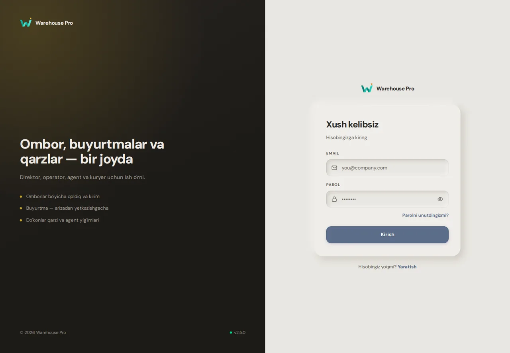

2. Telefon: o'sha e-mail va parol. Ilova kirishni eslab qoladi; qayta kirish — barmoq izi yoki Face ID orqali.

   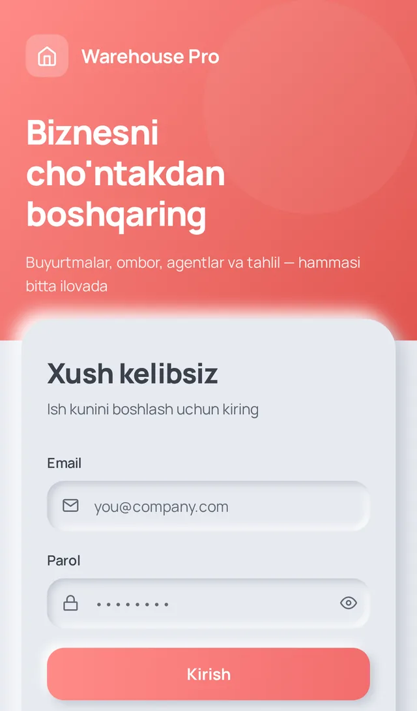

3. Til: vebda — menyu pastidagi РУС / UZB tugmalari; telefonda — Profil → Til.

   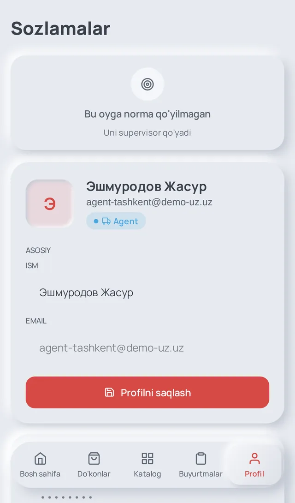

## Ofis operatori va ombor

Operator «Buyurtmalar»da ishlaydi: agentlarning buyurtmalarini qabul qilib tekshiradi, yuklash varaqalarini yig'adi, reyslarni kuryerlarga beradi, kirim va qaytarishlarni o'tkazadi.

1. Buyurtmalar. Bir qatorli xulosa — har bir raqam filtr: «Kutmoqda» — ofis qarorini kutayotgan buyurtmalar (masalan, chegirma chegaradan yuqori). Qatorga bosilsa buyurtma paneli ochiladi; kutayotgan buyurtmada — sabab va «Tasdiqlash / Rad etish» tugmalari.

   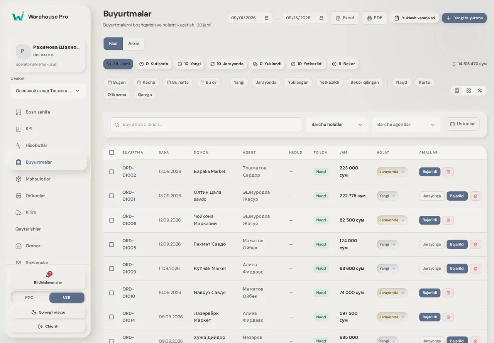

2. Qo'ng'iroq bo'yicha yangi buyurtma: do'kon (nomi, egasi, telefoni bo'yicha qidiruv; yonida qarz), tovarlar («bo'sh N» ko'rinadi), to'lov usuli — tayyor.

   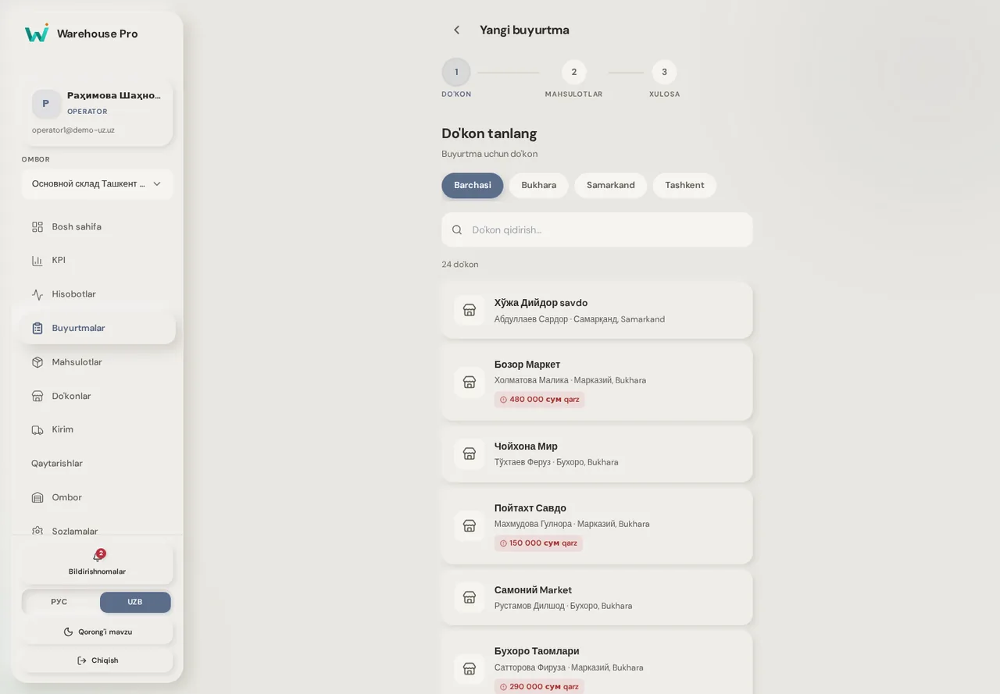

3. Yuklash varaqasi: buyurtmalarni belgilang → «Yuklash varaqalari» → «Varaqa tuzish» → chop etish. Varaqa yopilguncha o'z buyurtmalarini ushlab turadi; ularni ikkinchi marta yig'ib bo'lmaydi.

4. Qatorlar bo'yicha yig'ish: varaqalar ro'yxatida «tayyorlanmoqda» varaqada — «Yig'ish» tugmasi. Qatorlar: kerak / partiyalar (FEFO bo'yicha — jo'natishda hisobdan chiqariladigan o'shalar) / yig'ildi. Kerakdan kam — kamomad: u ro'yxatda ko'rinadi va ofisga bildirishnoma bo'lib boradi. So'ng — butun varaqaga bitta tanlov bilan kuryer.

5. Tovar kirimi: «Kirim» → yangi nakladnoy, tovar kodi yoki skaner bilan, partiya va yaroqlilik muddati → «Saqlash va yakunlash». Qoldiq faqat yakunlangandan keyin o'zgaradi.

   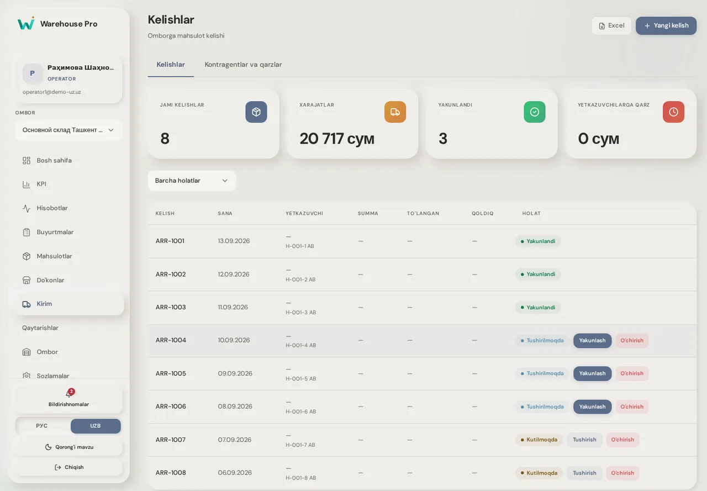

6. Ombor: qoldiqlar, partiyalar va muddatlar; «Ombor hisobotlari» — nima yaroqsiz bo'lmoqda. Do'konlardan qaytarishlarni ofis o'tkazadi; yetkazib beruvchiga qaytarish — «Kirim»dagi yetkazib beruvchi kartasidan.

   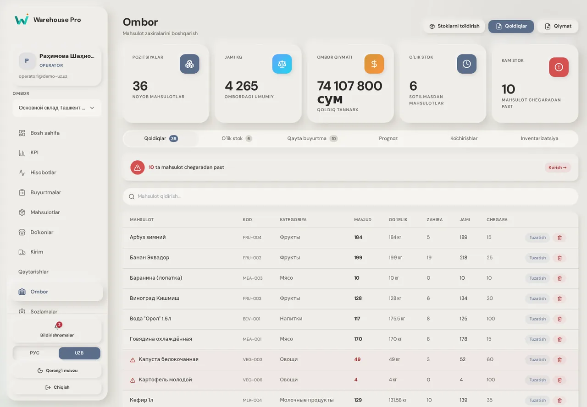

7. Shtrix-kodlar: tovarlarga va kirim bo'yicha yorliqlar chop etish; skaner-klaviatura tovar qidiruvi bor har joyda ishlaydi («kod + Enter»).

   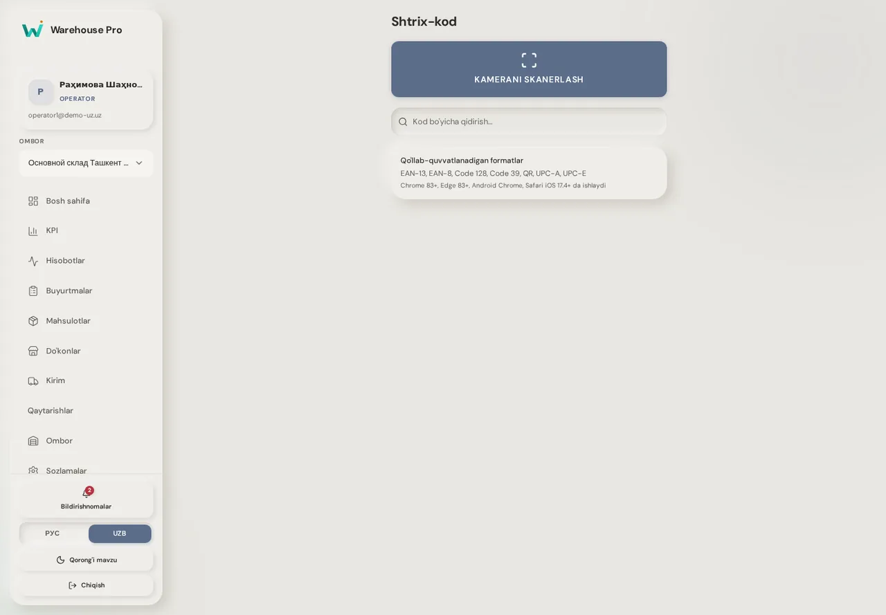

## Direktor

Direktorning beshta savoli — birinchi ekranda: bugun qancha sotildi va yetkazildi, kim qarzdor, omborda nima yaroqsiz bo'lmoqda, agentlardan kim ishlamayapti, oylik bilan nima gap.

1. Bosh sahifa: bugungi tushum va buyurtmalar (strelka — kechaga nisbatan), «yetkazildi N / M», mijozlar qarzi, marja. Pastdagi ogohlantirishlar bosiladi: muddati o'tgan — ombor hisobotlariga, qarz — «Qarzlar»ga.

   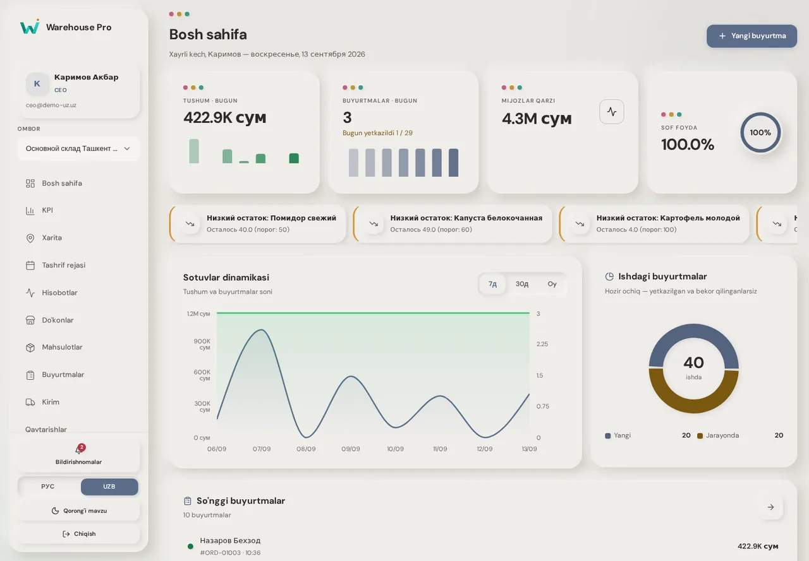

2. Agentlar KPI: ballar, sotuvlar, tashriflar jadvali; agentga bosilsa — tahlil va uning davr uchun oyligi. «GPS» ustuni — kimning xaritada izi yo'q.

   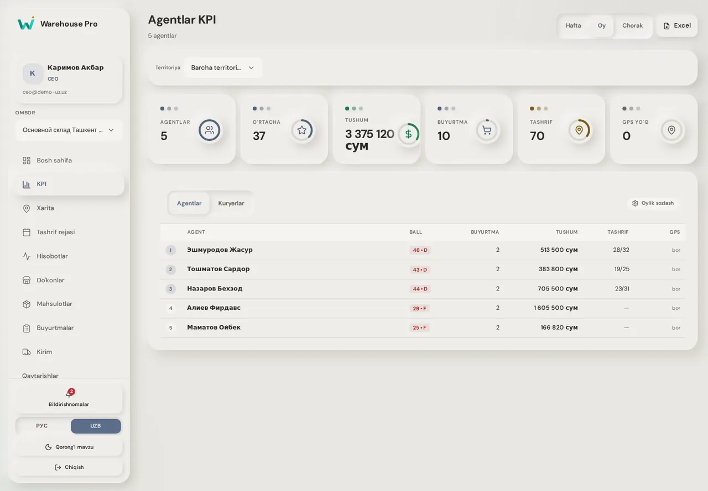

3. Xarita: kim aloqada, kim oldin bo'lgan, kim signalsiz; agentning kunlik yo'nalishi, tashrif fotolari, «koordinatalar almashtirilgan» — qizil.

   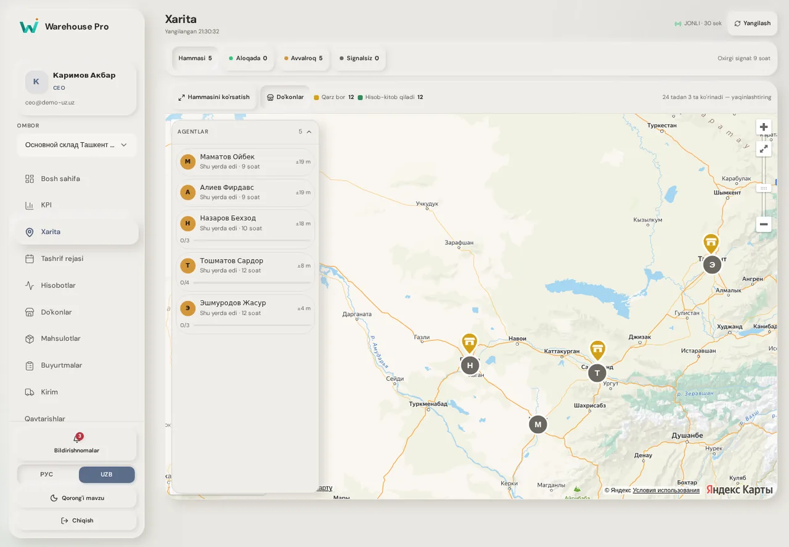

4. Hisobotlar va qarzlar: «Qarzlar» — kim, qancha va qachondan beri; qator do'kon kartasiga olib boradi. P&L — davr uchun foyda yoki zarar.

   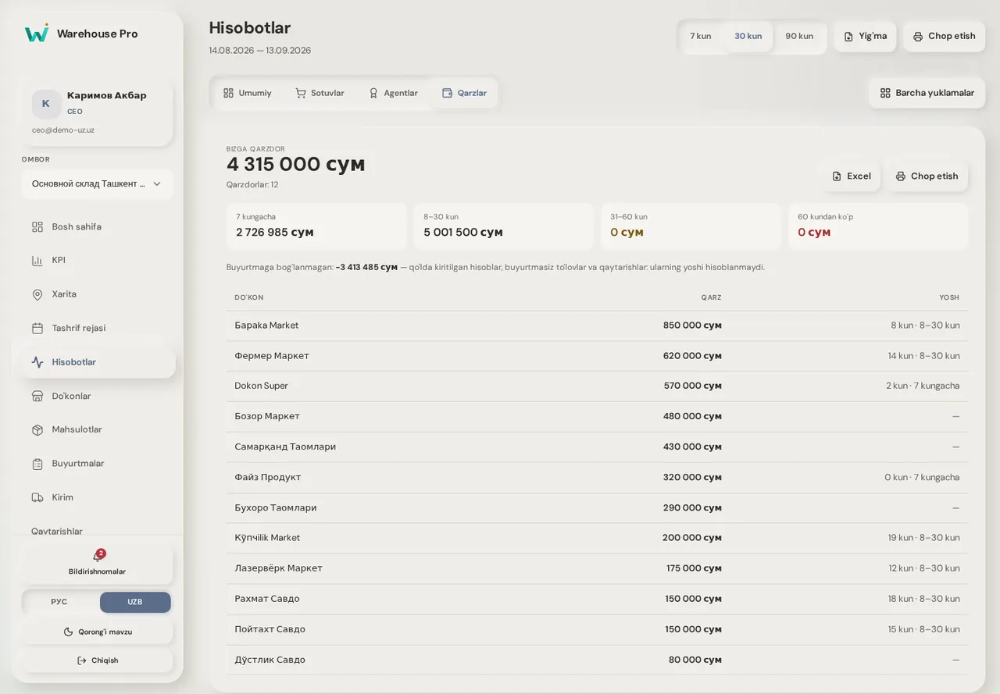

5. Oyliklar: fond, hisoblangan va berilgan; «Hammaga berish» — xodim telefonda olganini tasdiqlaydi. Maosh va foizlar sozlamasi — o'sha yerda.

   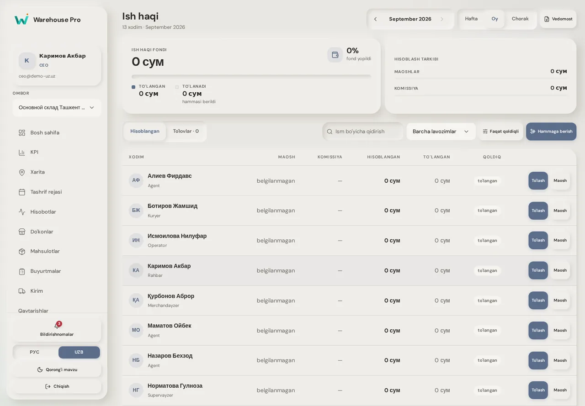

6. Foydalanuvchilar va amallar jurnali: kim nima qildi — buyurtma bekor qilindi, to'lov storno qilindi, limit o'zgardi; «Buyurtmalar / To'lovlar / Do'konlar» filtrlari.

   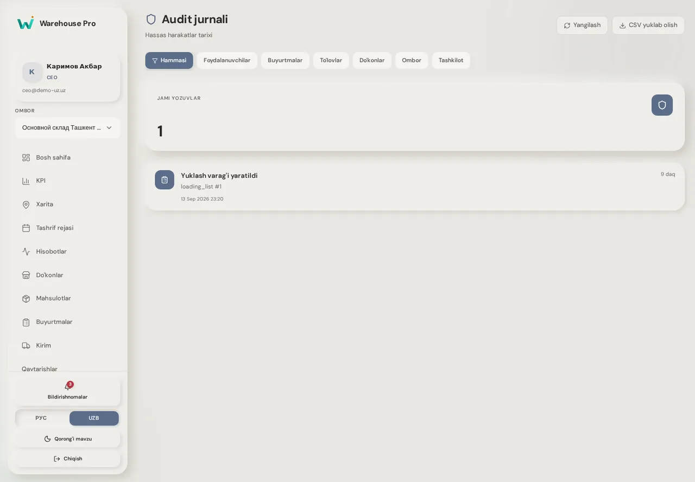

## Supervayzer

Ertalab — xarita: kim ishga chiqdi. Oy — bitta tugma bilan tashrif rejalari. Kechqurun — koordinatalar bo'yicha kun tahlili.

1. Xarita (veb): butun jamoa — «Aloqada / Oldin bo'lgan / Signalsiz»; har birida — kunlik aylanish x/y va norma foizi.

   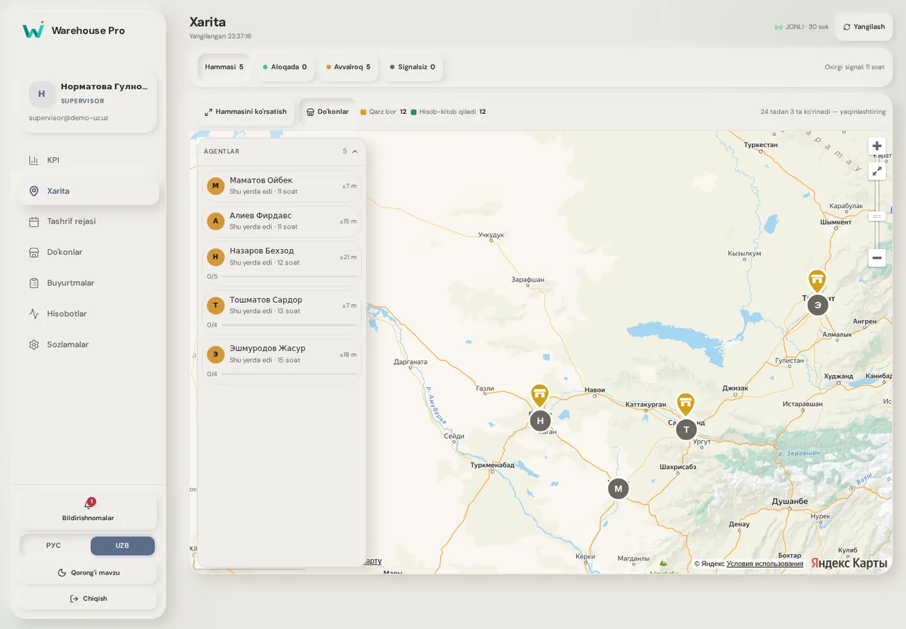

2. Rejalar: «Oy» bo'limi — agent, hudud, hafta kunlari → «Joylashtirish»; «Kun» bo'limi — «Kun qanday o'tdi»: nuqtalardagi vaqt, kilometrlar, izohlar.

   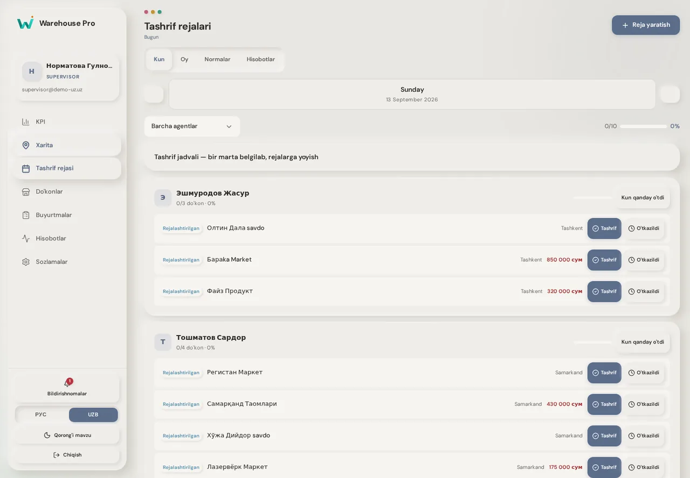

3. Telefon: «Xarita», «Rejalar», «Normalar» — yo'lda ham o'sha.

   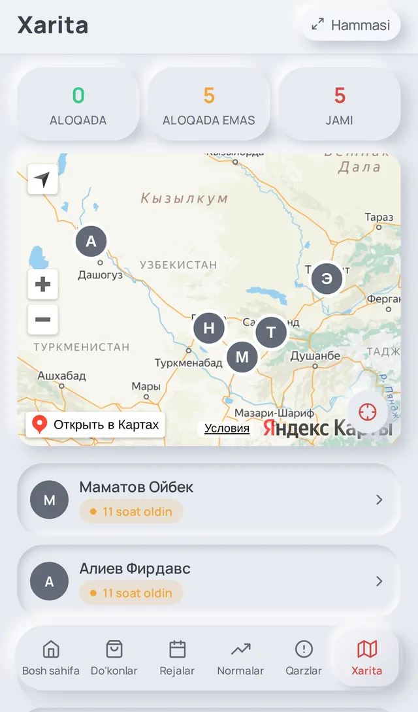

## Savdo agenti (telefon)

Kuniga 30–60 tashrif. Bosh sahifa — tashriflar va qarzlar; peshtaxta oldida bir daqiqada buyurtma; hammasi aloqasiz ishlaydi va o'zi jo'natiladi.

1. Bosh sahifa: bugungi tashriflar (qator do'konga olib boradi), «Qarzlar» plitkasi — kimdan undirish kerak, kunlik tushum va buyurtmalar.

   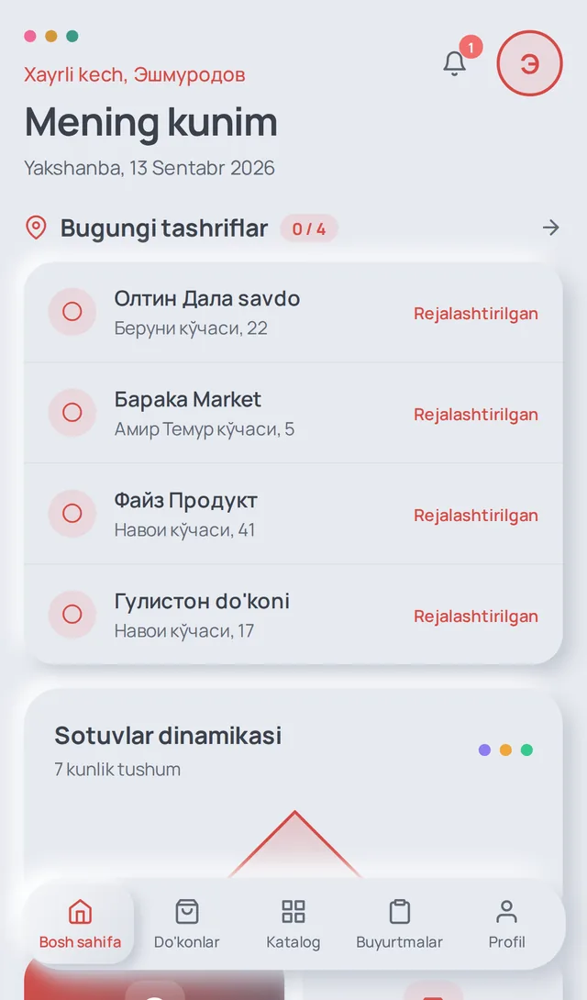

2. Do'konlar: yaqinlari birinchi, kartadagi savat — bir teginishda buyurtma. Yangi do'kon nuqtaning o'zida ochiladi.

   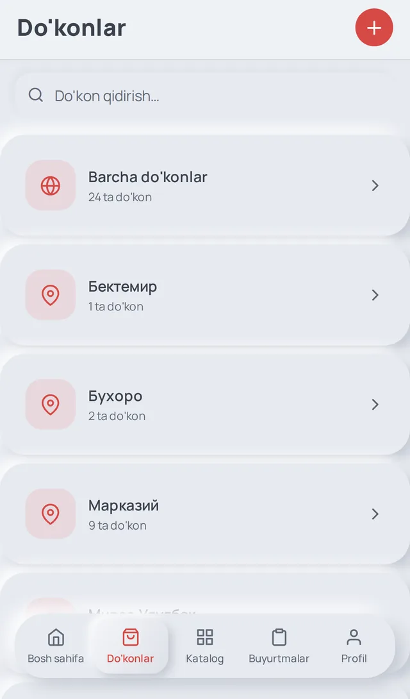

3. Yangi buyurtma — uch qadam: do'kon → tovarlar (qidiruv, skaner, «− n +», qoldiq ko'rinadi) → to'lov va va'da qilingan muddat → Tasdiqlash.

   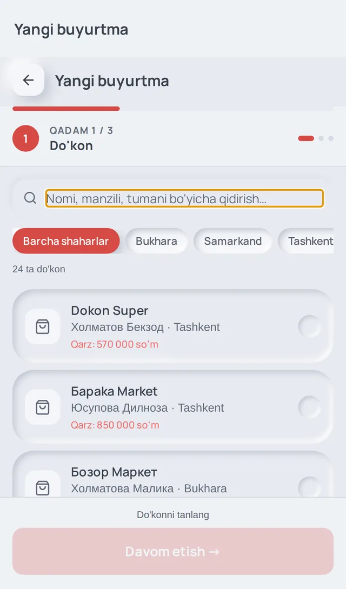

4. Aloqasiz: do'konlar ro'yxati va katalog telefondagi nusxadan olinadi (sanasi bilan), buyurtma navbatga tushadi va o'zi jo'natiladi. «Buyurtmalar»da kechiktirilganlar «jo'natish kutilmoqda» kartalari bilan ko'rinadi.

   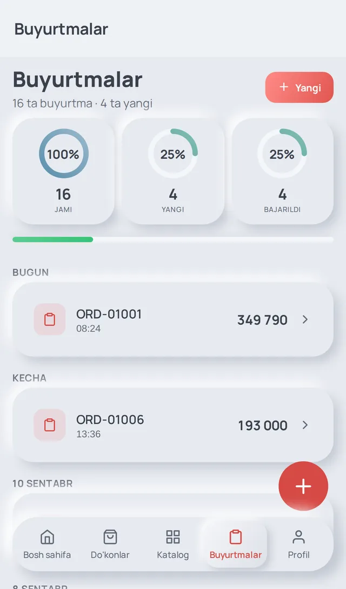

5. Reja: «Tayyor» tashrifni belgilaydi (foto bilan yoki fotosiz); aloqasiz belgi saqlanadi va o'zi ketadi. Qarzlar: qarzdorlar ro'yxati, bir teginishda qo'ng'iroq.

   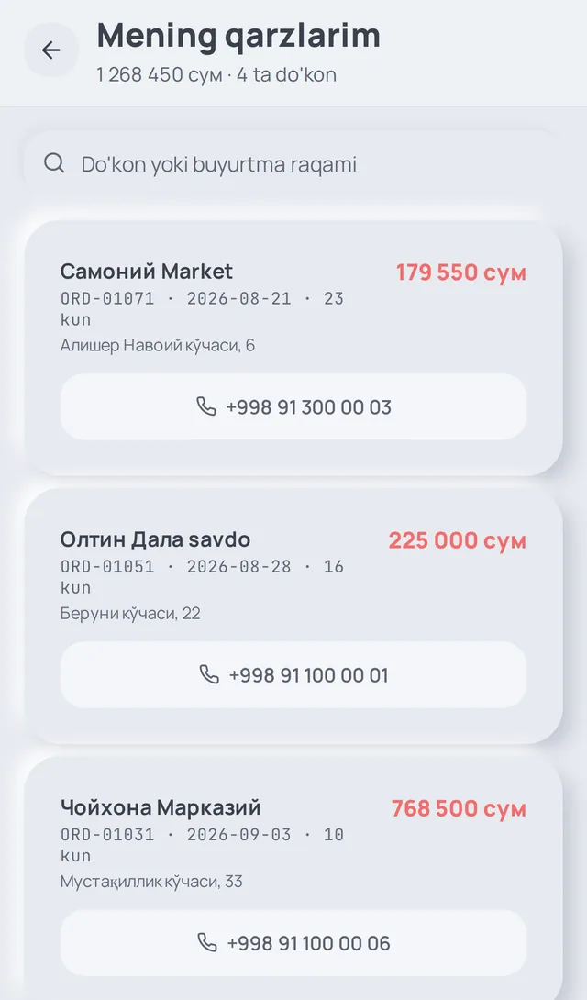

6. Oylik: davr uchun hisoblangan, qo'lga berilgan — «Oldim» to'lovni tasdiqlaydi.

   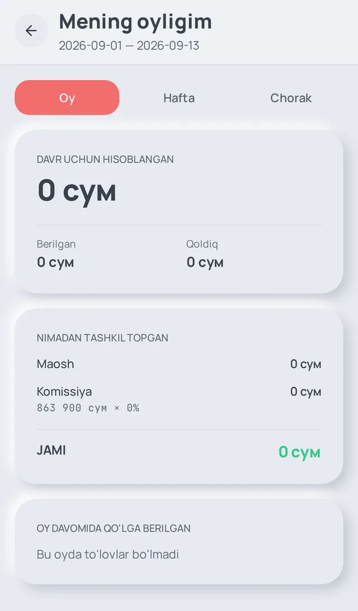

## Kuryer (telefon)

Ertalab — «Hammasiga yo'lga chiqdim». Nuqtada — naqd summa va «Yetkazildi», yoki sababi bilan «Yetkazilmadi», yoki qisman to'lov va qaytarish uchun «Batafsil rasmiylashtirish». Hammasi — aloqasiz.

1. Yetkazishlar: yuqorida «Kutmoqda N · Yo'lda M», «Hammasiga yo'lga chiqdim» tugmasi. Karta: manzil, «Xaritada» (koordinatalar bo'yicha yo'nalish), summa, buyurtma tarkibi.

   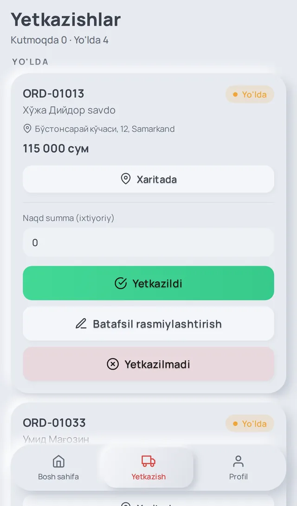

2. Qisman qaytarish pul bilan birga rasmiylashtiriladi: qaysi tovarlar qaytdi, qolgani uchun qancha to'landi, qachon qo'shimcha to'lanadi. Sanani odatdagidek yozish mumkin — 15.09.2026.

3. Server rad etgan belgi (masalan, buyurtma allaqachon yopilgan) sababi va «Qayta / Olib tashlash» tugmalarini ko'rsatadi. Oylik — Bosh sahifada.

   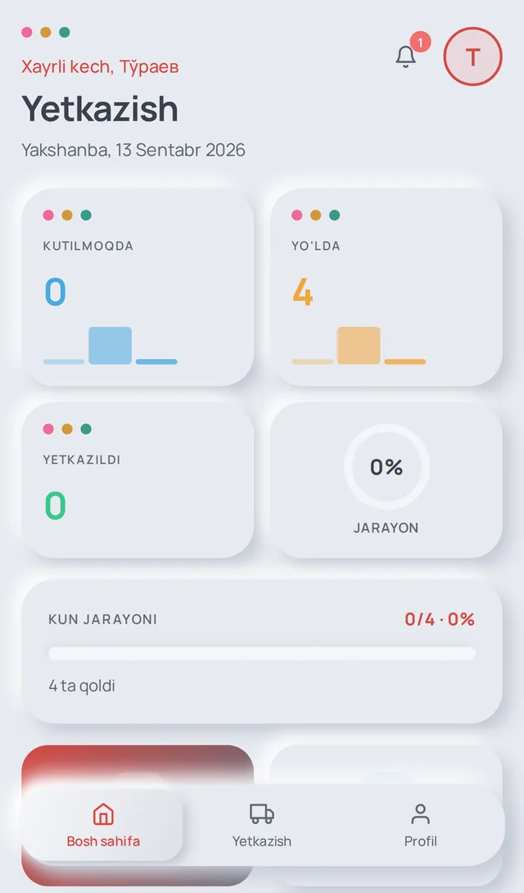

## Merchandayzer (telefon)

Kunlik reja → nuqtada «Tayyor» hisobotni ochadi: javon fotosi, narx va aksiya bilan tovarlar ro'yxati, izohlar.

1. Bosh sahifa va Reja: faqat tashriflar, do'konlar va profil — sotuv haqidagi begona bloklarsiz.

   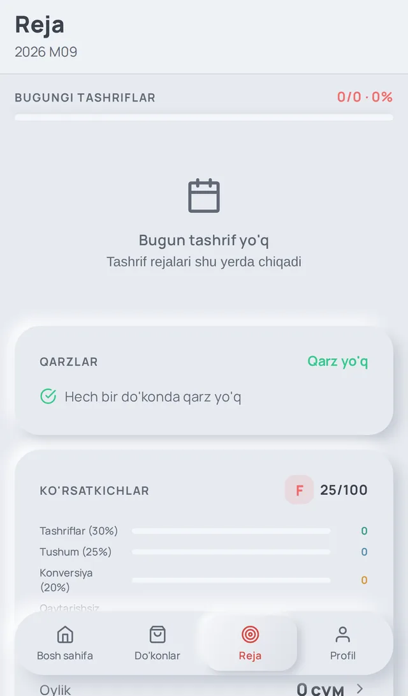

2. Tashrif hisoboti: kameradan surat, tovarlar bo'yicha belgilar, «Tashrifni yakunlash». Chalg'isangiz, qoralama bir kun saqlanadi.

   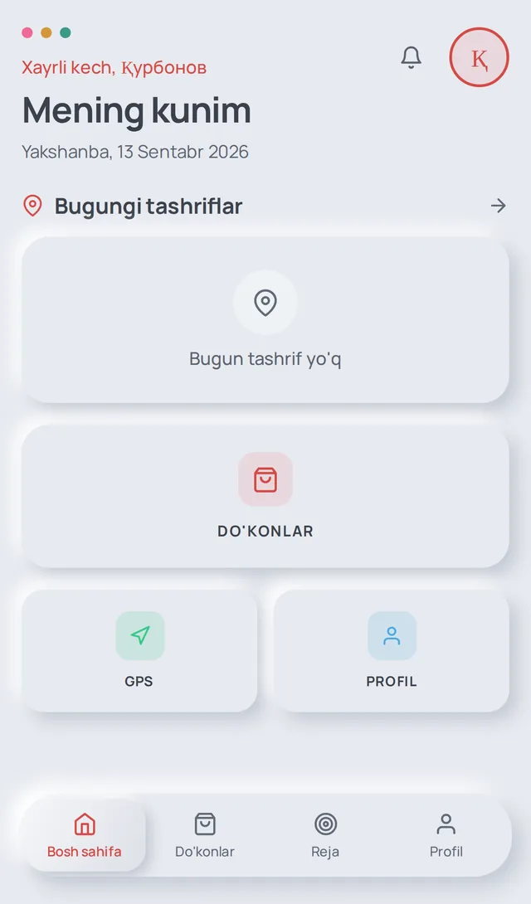
